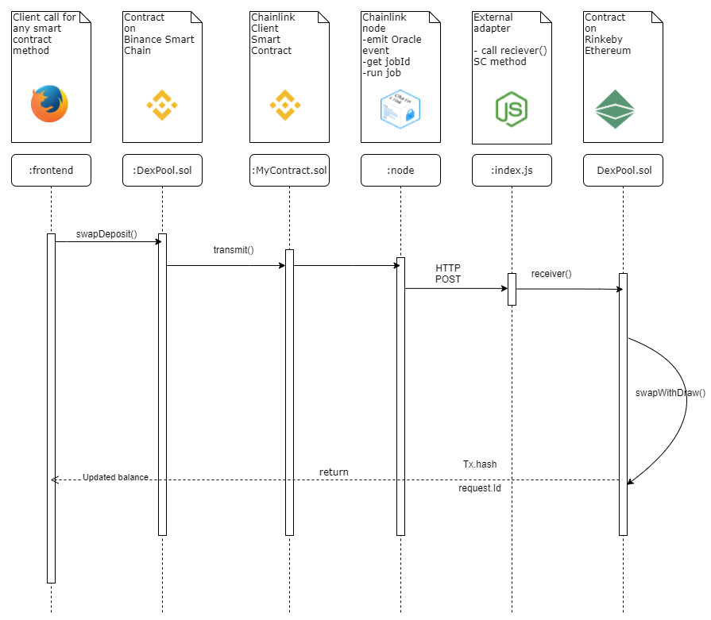
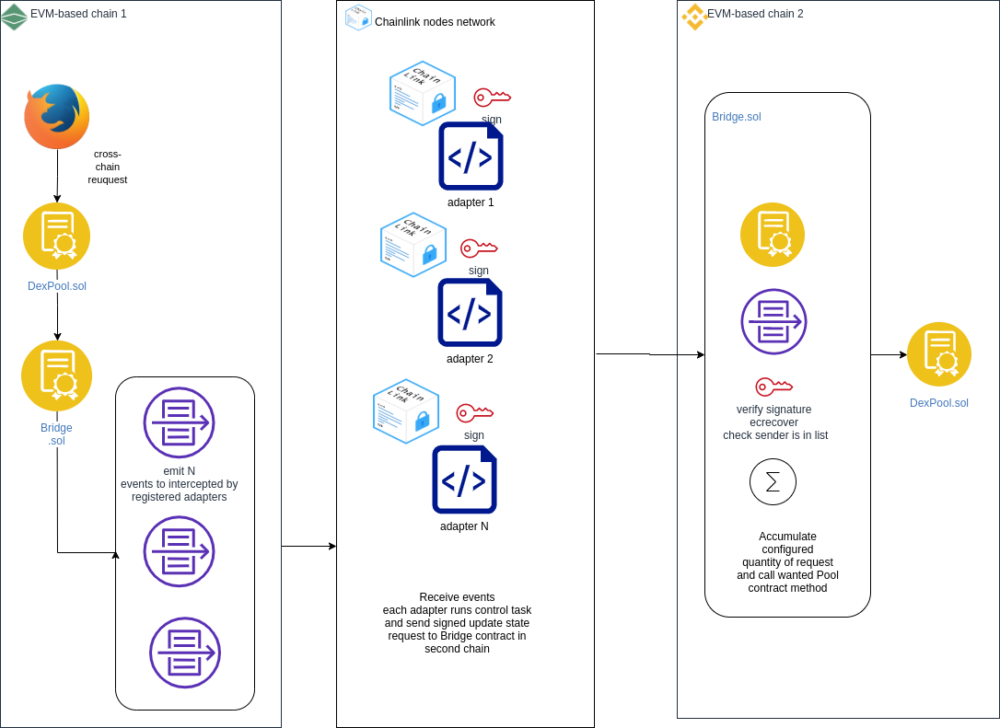
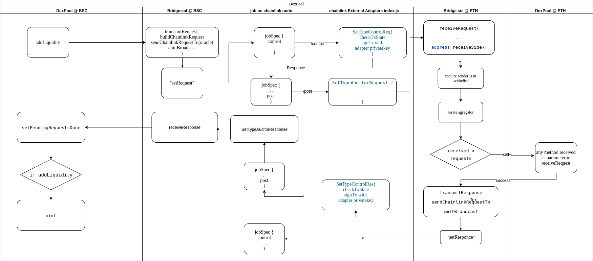

# DexPool - liquidity pool and cross-chain bridge for EVM-based chains with better user experience.
Contined work on https://github.com/digiu-ai/MarketMake 

# **Description**

The goal of our project is to create a **cross-chain*** swap between hetregenous blockchains.

# **How It's Made**

For now we have POC V2 version of cross-chain bridge. It utilises decentralization in spite of using chainlink infrastructure to be hosted on.

## Use cases
- User can swap any Ethereum asset to pegged BSC asset of same type (for example USDT ERC20  <-> USDT BEP20)
- User can swap a token of any type from Ethereum for any existing BSC token (ETH <-> BNB ) 
- Dexpool protocol can emit new BSC asset, the collateral is proved through Chainlink ETH-to-BTC integration (asset is locked by contract on Ethereum side, proof is send throgh chainlink to BSC,  new pegged asset is emited on BSC and sent to user)

## Version 1 Architecture

The prototype will include functionality
- add **ERC20**-like asset to DexPool of any configured chain
- make "pair" of two assets not depending to what chain each of them belong
- swap assets between chains with minimum rate calculations
- developed **chainlink external adapter script** is used to  get data from external chain and change state of another chain's smart contract 
- "bidirectional" wallet is implemented on front for better user experience

### DexPool contract
DexPool is deployed to both Ethereum and Binance Smart Chain networks. The methods like **swap, withdraw, addLiquidity** are implemented to be used from native chain as well as method **reciever** is used to be called from external chain through adapter.

[comment]: <> (## Architecture Diagram)

[comment]: <> (![Architecture Diagram]&#40;./img/diagram.png&#41;)

## Version 1 cross-chain SwapDeposit Sequence Diagram

## V2 Architecture

V2 brings decentralization into somehow centralized chainlink ecosystem. We added possibility for multiple adapter to process cross-chain request grained with security checks. Adapters register in smart contract to participate. Adaters requests are checked for convinience onchain.

## Version 2 "whole picture" diagram

## Version 2 integration diagram

