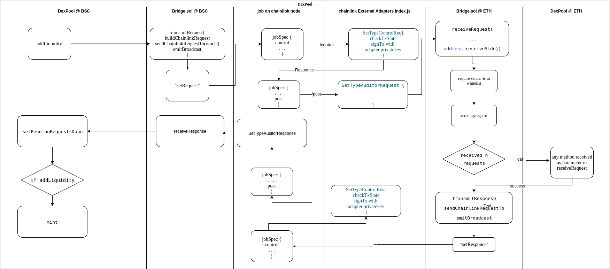

# DExPool
Liquidity pool that allows cross-chain swaps and liquidity operations using chainlink oracle network. 
Pool pairs can consist of assets from different chains.


## DexPool cross-chain operation Diagram




## Deploy

- clone repo install and start
````
git clone ssh://git@bitbucket.digiu.ai:7999/bcl/Digiu.Lab.git
cd Digiu.Lab
npm install
npm start
````
- add "control" external adapter
````
npm run add-control-adapter-1
````
- add "post" changing state external adapter
````
npm run add-post-adapter-1
````
- same for second chainlink node
````
npm run add-control-adapter-2
npm run add-post-adapter-2
````
- register job specs on chainlink nodes
````
npm run add-jobspec-1
npm run add-jobspec-2
````
- set job pernission in contract
````
npm run set-permission-job-id-1
npm run set-permission-job-id-2
````


## Test


- check balances
```bash
npm run check-results
```


- add liquidity
```bash
npm run add-liquidity
```

- swap from network1
```bash
npm run swap-from-1
```


